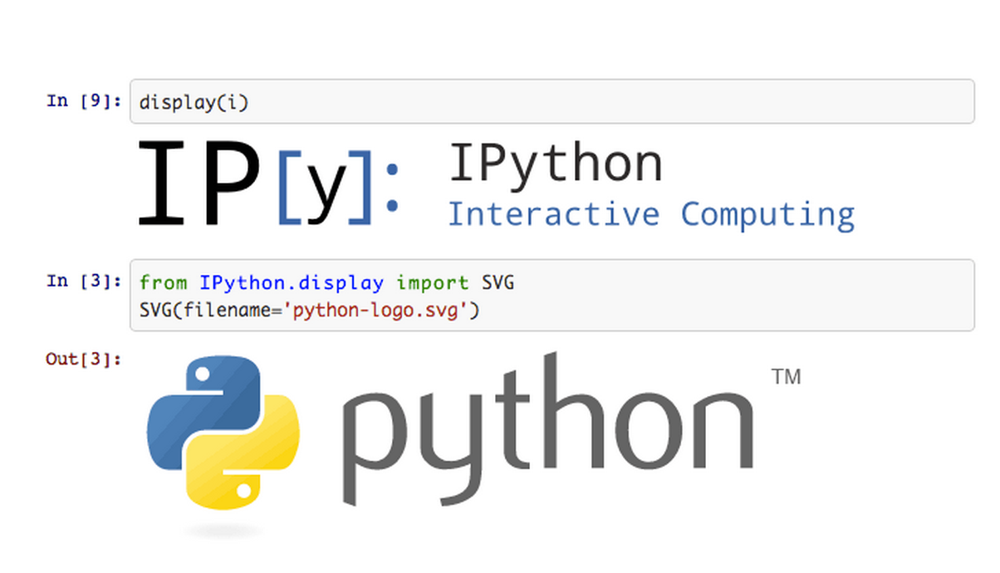

# Análise de Prestação de Contas Partidárias de Eleições Estaduais

## FATEC SJC - Professor Jessen Vidal

### Curso: Tecnologia em Banco de Dados

### **Disciplina:** Projeto de Banco de Dados não Estruturados

### **Professor:** Me. Fernando Masanori Ashikaga

### **Tema do Projeto:** Análise de Prestação de Contas Partidárias de Eleições Estaduais

### Membros do Grupo

|             **Nome**    	     |             **Email**           |                **Github**            	 |
|:------------------------------:|:-------------------------------:|:---------------------------------------:|
| Francilei Augusto dos Santos   |  augustodossantos.ti@gmail.com  |  https://github.com/augustodossantosti  |
| Robson de Sousa 	             |  robsoncartes@outlook.com       |  https://github.com/robsoncartes  	     |

\
\
Imagem meramente ilustrativa. Posteriormente será substitúida por uma imagem relacionada ao tema.

##  **DISCLAIMER | AVISO LEGAL**
Esse Jupyter notebook tem um fim único e exclusivamente didático, para alunos da FATEC, como uma introdução à Análise de Dados Públicos. Desse modo, está excluída a garantia ou responsabilidade de qualquer tipo, por exemplo, de precisão, confiabilidade, completude e atualidade das informações.

## Descrição do Projeto e do Problema

Para a realização desse trabalho utilizamos a API [Brasilian Elections Python](https://github.com/Cepesp-Fgv/cepesp-python) cujos dados foram extraídos do repositório oficial do Tribubal Superior Eleitoral (TSE). Utilizamos a biblioteca Pandas que é uma ferramenta de manipulação e análise de dados de código aberto construído com base na linguagem de programação Python.

Inicialmente esse trabalho visa apresentar os detalhes sobre bens ou bens declarados pelos candidados de cada eleição. Nesse exemplo, utilizamos dados referentes as eleições de 2010, 2014 e 2018.

## Project setup

Aqui pode vir uma descrição do ambiente necessário para realização desse laboratório, como por exemplo:

- Configuração do ambiente
- Bibliotecas e Tecnologias utilizadas
- Execução do projeto