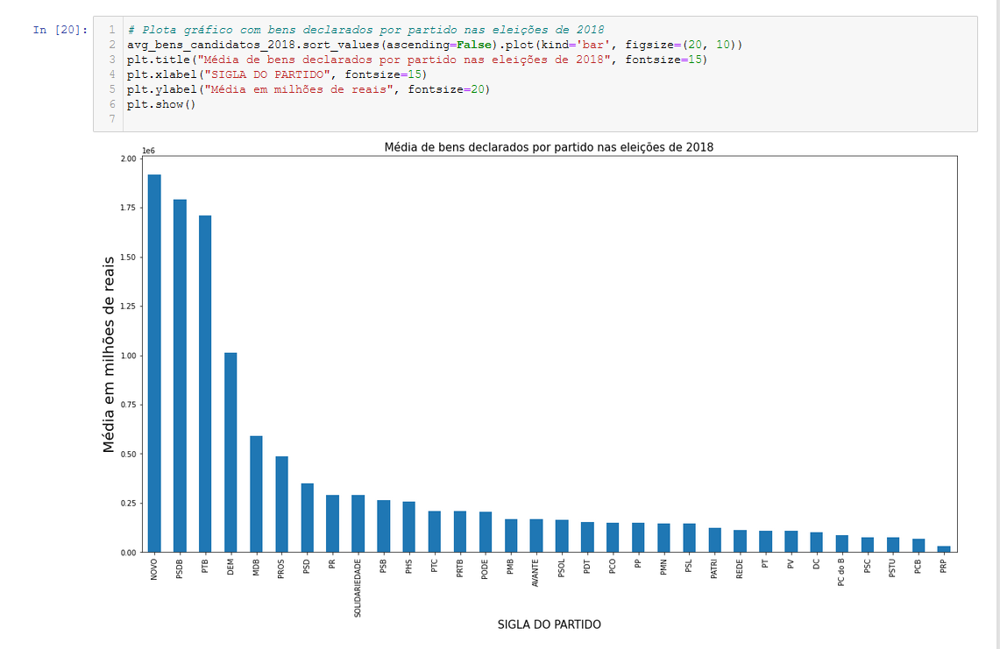

# Análise de Prestação de Contas Partidárias de Eleições Estaduais

## FATEC SJC - Professor Jessen Vidal

### Curso: Tecnologia em Banco de Dados

### **Disciplina:** Projeto de Banco de Dados não Estruturados

### **Professor:** Me. Fernando Masanori Ashikaga

### **Tema do Projeto:** Análise de Prestação de Contas Partidárias de Eleições Estaduais

### Membros do Grupo

|             **Nome**    	     |             **Email**           |                **Github**            	 |
|:------------------------------:|:-------------------------------:|:---------------------------------------:|
| Francilei Augusto dos Santos   |  augustodossantos.ti@gmail.com  |  https://github.com/augustodossantosti  |
| Robson de Sousa 	             |  robsoncartes@outlook.com       |  https://github.com/robsoncartes  	     |

\

##  **DISCLAIMER | AVISO LEGAL**
Esse Jupyter notebook tem um fim único e exclusivamente didático, para alunos da FATEC - SJC , como uma introdução à Análise de Dados Públicos. Desse modo, está excluída a garantia ou responsabilidade de qualquer tipo, por exemplo, de precisão, confiabilidade, completude e atualidade das informações.

## Descrição do Projeto e do Problema

Em primeiro momento esse trabalho tem como finalidade apresentar uma análise de prestação de contas partidárias das eleições estaduais de 2010, 2014 e 2018.

Foi utilizado nesse projeto a API [Brasilian Elections Python](https://github.com/Cepesp-Fgv/cepesp-python) desenvolvido em Python e que se comunica com API CEPESPdata. Todos os dados foram extraídos do repositório
oficial do TSE [Repositório de Dados Eleitorais](https://www.tse.jus.br/eleicoes/estatisticas/repositorio-de-dados-eleitorais-1). Além disso, utilizamos a bibliocata Pandas, que é uma ferramenta muito utilizada para manipulação e análise de dados de código aberto constrúido com base na linguagem de programação Python.

Esse projeto de laboratório faz parte dos requisitos necessários para obtenção da aprovação na disciplina Projeto de Banco de Dados não Estruturados. E o mais importante, esse projeto visa propiciar aos estudantes do curso de Tecnologia em Banco de Dados, uma visão introdutória sobre Análise de Dados Públicos e Data Science.

[Link para esse Jupyter Notebook](AnaliseDePrestacaoDeContasPartidariasDeEleicoesEstaduais.ipynb)

## Project setup

Para configurar o ambiente minímo necessário para a execução desse projeto localmente, assim como a instalação das dependências desse projeto, recomendamos assistir a seguinte playlist:
[Análise de Dados Públicos](https://www.youtube.com/playlist?list=PLUukMN0DTKCu6g2Lq1KXLnIX6Ilk4DAPI) disponível no canal Python para Zumbis no Youtube.

